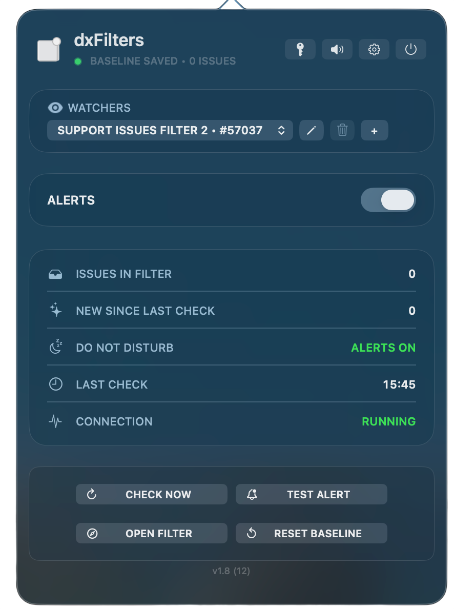

<h1>
  
  dxFilters
</h1>

<p align="center">
  
</p>

macOS menu bar app that polls a saved **Jira filter** and shows **Notification Center** alerts when **new issue keys** appear.

## Requirements

**The repo does not ship ready-to-run binaries.** Each Mac installs tools once, then runs setup below.

| Included in git | Not included (install locally) |
|-----------------|--------------------------------|
| Python source (`jira_alert.py`), `requirements.txt` | Python virtualenv (`.venv/`) and `pip install` |
| Swift source, icons, sounds | Built app (`dxFilters.app` — run `install.sh`) |
| | Jira URL + personal access token (PAT), set in the panel — use your instance (`https://<BASE_URL>`) |

**On each new Mac (one-time):**

- macOS 12+
- **Python 3.10+**
- **Xcode Command Line Tools** — `swiftc`, `sips`, `iconutil`, `codesign` (used by `install.sh`)
- **`pip install -r backend/requirements.txt`** in a venv (only [`requests`](backend/requirements.txt))

## Notifications (dxFilters only)

Banners are **not** sent from the Python CLI. They use **UserNotifications** inside **`dxFilters.app`**, which registers the app in **System Settings → Notifications**.

After `./frontend/menubar/install.sh`:

1. macOS prompts to allow notifications, or open **System Settings → Notifications → dxFilters**.
2. Turn notifications **on** and choose **Banners** or **Alerts**.
3. Use **Test Alert** in the menu bar panel to confirm.

On a new Mac, **dxFilters** appears in that list only after the installed app has been opened at least once.

## Quick start

From the repository root:

```bash
cd backend
python3 -m venv .venv
source .venv/bin/activate
python3 -m pip install --upgrade pip
pip install -r requirements.txt
cd ..

./frontend/menubar/install.sh
```

When the app opens, click the menu bar icon and use the **key** icon (next to the speaker). Enter your **Jira URL** (`https://<BASE_URL>`, no trailing slash) and **PAT**. Credentials are saved to `~/.config/jira-alert/credentials.env` (mode `600`).

For CLI-only use, copy [`.env.example`](.env.example) to `.env` and replace `<BASE_URL>` with your Jira host.

First poll saves a **baseline** (no burst). Later polls notify only for new keys.

## Configuration

| Setting | Where |
|---------|--------|
| Jira URL + PAT | Panel **key** icon → `~/.config/jira-alert/credentials.env` |
| Saved filters | Panel (+ / dropdown) → `~/.config/jira-alert/filters.json` |
| Per-filter state | `~/.config/jira-alert/states/<id>.json` |
| Poll interval (CLI `--loop` only) | `POLL_INTERVAL_SECONDS` env var (default `300`) |

Manage filters from the panel or CLI:

```bash
cd backend && source .venv/bin/activate
python jira_alert.py --add-filter 12345 --set-filter 12345
python jira_alert.py --remove-filter 12345
python jira_alert.py --filters-json
```

## Usage

### Menu bar (notifications + polling)

```bash
./frontend/menubar/install.sh   # build, install to ~/Applications/, and open
```

`install.sh` runs `build.sh` automatically. Use `build.sh` alone only if you want the app bundle under `frontend/menubar/` without installing.

The app polls via `jira_alert.py --check-json` and posts alerts as **dxFilters** in Notification Center.

### CLI (polling and state only)

From `backend/` with the venv active — **no banners** from these commands:

```bash
python jira_alert.py                      # one check (prints results)
python jira_alert.py --check-json         # JSON (used by the menu bar app)
python jira_alert.py --dry-run
python jira_alert.py --reset-baseline
python jira_alert.py --loop               # POLL_INTERVAL_SECONDS
python jira_alert.py --test-notification  # how to test via the menu bar app
```

## Local data

| Path | Purpose |
|------|---------|
| `~/.config/jira-alert/repo.path` | Repo root for the installed app |
| `~/.config/jira-alert/credentials.env` | Jira URL + PAT (from panel key icon) |
| `~/.config/jira-alert/filters.json` | Saved filters and active filter |
| `~/.config/jira-alert/states/<id>.json` | Per-filter seen issue keys |

After JQL changes, **Reset Baseline** in the panel or `python jira_alert.py --reset-baseline`.

## Project layout

```txt
backend/              Python poller (jira_alert.py)
frontend/menubar/     Swift app (dxFilters), build/install scripts
```

## License

[MIT](LICENSE) — Copyright (c) 2026 Ricardo Costa
